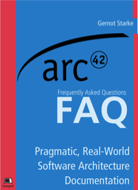

# arc42-faq
public &amp; free FAQ for arc42. Complements the book [arc42-in-Practice]()

1. Sources are maintained in another repository!!
2. Markdown sources are copied over to this repo.
3. pdf/epub and public website is rendered by LeanPub, 
4. Additionally, a gitbook is created from the same sources
5.  




## Don't Modify Content Here

The content of this book is maintained in [**another** (private) repository](https://github.com/gernotstarke/arc42-in-practice). In case you want to contribute,
let me know (mailto gs@gernotstarke.de).

**THIS** repo is used to generate a free LeanPub book + [website](https://leanpub.com/arc42-faq/read).

## Copy and filter files

The gradle buildscript contained in this repo can copy over
the required markdown files from the arc42-in-practice repo.

Just run the following command from a shell in the root-dir
of this project:

```
gradle copyFAQ
```

That command depends on the directory structure _baked_ into the gradle script.

## Gitbook
Gitbook requires special files and directories (especially `SUMMARY.md`, `README.md` and `book.json`). Explanations are given on the [gitbook documentation site](http://toolchain.gitbook.com/structure.html).

There's a [Github issue](https://github.com/gernotstarke/arc42-in-practice/issues/29) to automate gitbook generation from Leanpub markdown...

Several features of the current leanpub markdown (anchors, cross-refs, tables-width-settings, image-formating-settings) don't work in Gitbook.


## License
This content is licensed under a Creative-Commons Sharealike 4.0 license.
