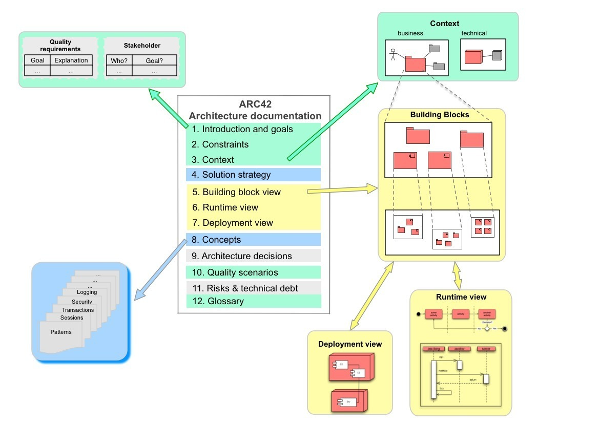

# Introduction

C>These (English) FAQ are currently in a quite early state.
C>I'm translating them from their German original as fast as I can...  

Here you find answers to the most common questions regarding arc42,
the proven, practical (free!) standard for documenting and communicating
software architecture. These FAQ have been extracted from the book
[arc42 in practice](https://leanpub.com/arc42inpractice/)
(which itself is an enhanced translation
  from the German-language printed book 
  [arc42 in Aktion](https://www.amazon.de/arc42-Aktion-Praktische-Tipps-Architekturdokumentation/dp/3446448012).

{width=15%,float=left}

arc42 is based on years of experience and used successfully since 2005 in many companies and
organizations in different application domains.

First of all arc42 is a template for architecture documentation.
It answers the following two questions in a pragmatic way:

* _What_ should we document/communicate about our architecture?
* _How_ should we document/communicate?

The diagram below gives you the big picture: It shows a (slightly simplified)
overview of the structure of arc42.

If you want to lean more about arc42: There are plenty of
[examples available](https://leanpub.com/arc42byexample).
